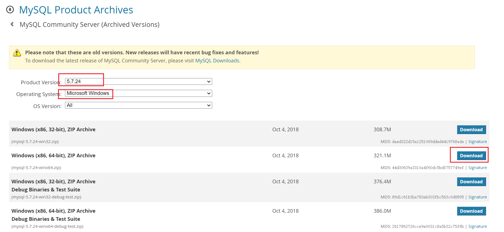

> **安装环境:Win10 64位**
> **软件版本:MySQL 5.7.24 解压版**

## 一、下载

点开下面的链接：
https://downloads.mysql.com/archives/community/



选择选择和自己**系统位数**相对应的版本点击右边的`Download`，此时会进到另一个页面，同样在接近页面底部的地方找到如下图所示的位置：


不用理会上面的登录和注册按钮，直接点击`No thanks, just start my download.`就可以下载。


------

## 二、安装(解压)

下载完成后我们得到的是一个压缩包，将其解压，我们就可以得到MySQL 5.7.24的软件本体了(就是一个文件夹)，我们可以把它放在你想安装的位置。

------


## 三、配置

### 1. 添加环境变量

> 环境变量里面有很多选项，这里我们只用到`Path`这个参数。为什么在初始化的开始要添加环境变量呢？
> 在黑框(即CMD)中输入一个可执行程序的名字，Windows会先在环境变量中的`Path`所指的路径中寻找一遍，如果找到了就直接执行，没找到就在当前工作目录找，如果还没找到，就报错。我们添加环境变量的目的就是能够在任意一个黑框直接调用MySQL中的相关程序而不用总是修改工作目录，大大简化了操作。


右键`此电脑`→`属性`，点击`高级系统设置`


点击`环境变量`


在`系统变量`中新建MYSQL_HOME


在`系统变量`中找到并**双击**`Path`


点击`新建`


最后点击确定。

**如何验证是否添加成功？**

右键开始菜单(就是屏幕左下角)，选择`命令提示符(管理员)`，打开黑框，敲入`mysql`，回车。
如果提示`Can't connect to MySQL server on 'localhost'`则证明添加成功；
如果提示`mysql不是内部或外部命令，也不是可运行的程序或批处理文件`则表示添加添加失败，请重新检查步骤并重试。

### 2. 新建配置文件

新建一个文本文件，内容如下：

```properties
[mysql]
default-character-set=utf8

[mysqld]
character-set-server=utf8
default-storage-engine=INNODB
sql_mode=STRICT_TRANS_TABLES,NO_ZERO_IN_DATE,NO_ZERO_DATE,ERROR_FOR_DIVISION_BY_ZERO,NO_AUTO_CREATE_USER,NO_ENGINE_SUBSTITUTION
```

把上面的文本文件另存为，在保存类型里选`所有文件 (*.*)`，文件名叫`my.ini`，存放的路径为MySQL的`根目录`(例如我的是`D:\software\mysql-5.7.24-winx64`,根据自己的MySQL目录位置修改)。


上面代码意思就是配置数据库的默认编码集为utf-8和默认存储引擎为INNODB。

### 3. 初始化MySQL

在刚才的黑框中敲入`mysqld --initialize-insecure`，回车，稍微等待一会，如果出现没有出现报错信息(如下图)则证明data目录初始化没有问题，此时再查看MySQL目录下已经有data目录生成。

```
mysqld --initialize-insecure
```


tips：如果出现如下错误


是由于权限不足导致的，去`C:\Windows\System32` 下以管理员方式运行 cmd.exe


### 4. 注册MySQL服务

在黑框里敲入`mysqld -install`，回车。

```
mysqld -install
```


现在你的计算机上已经安装好了MySQL服务了。

MySQL服务器


### 5. 启动MySQL服务

在黑框里敲入`net start mysql`，回车。

```java
net start mysql  // 启动mysql服务
    
net stop mysql  // 停止mysql服务
```


### 6. 修改默认账户密码

在黑框里敲入`mysqladmin -u root password 1234`，这里的`1234`就是指默认管理员(即root账户)的密码，可以自行修改成你喜欢的。

```
mysqladmin -u root password 1234
```


**至此，MySQL 5.7 解压版安装完毕！**

------

## 四、登录MySQL

右键开始菜单，选择`命令提示符`，打开黑框。
在黑框中输入，`mysql -uroot -p1234`，回车，出现下图且左下角为`mysql>`，则登录成功。

```
mysql -uroot -p1234
```


**到这里你就可以开始你的MySQL之旅了！**

退出mysql：

```
exit
quit
```

登陆参数：

```
mysql -u用户名 -p密码 -h要连接的mysql服务器的ip地址(默认127.0.0.1) -P端口号(默认3306)
```


------

## 五、卸载MySQL

如果你想卸载MySQL，也很简单。

右键开始菜单，选择`命令提示符(管理员)`，打开黑框。

1. 敲入`net stop mysql`，回车。

```
net stop mysql
```


2. 再敲入`mysqld -remove mysql`，回车。

```
mysqld -remove mysql
```


3. 最后删除MySQL目录及相关的环境变量。

**至此，MySQL卸载完成！**