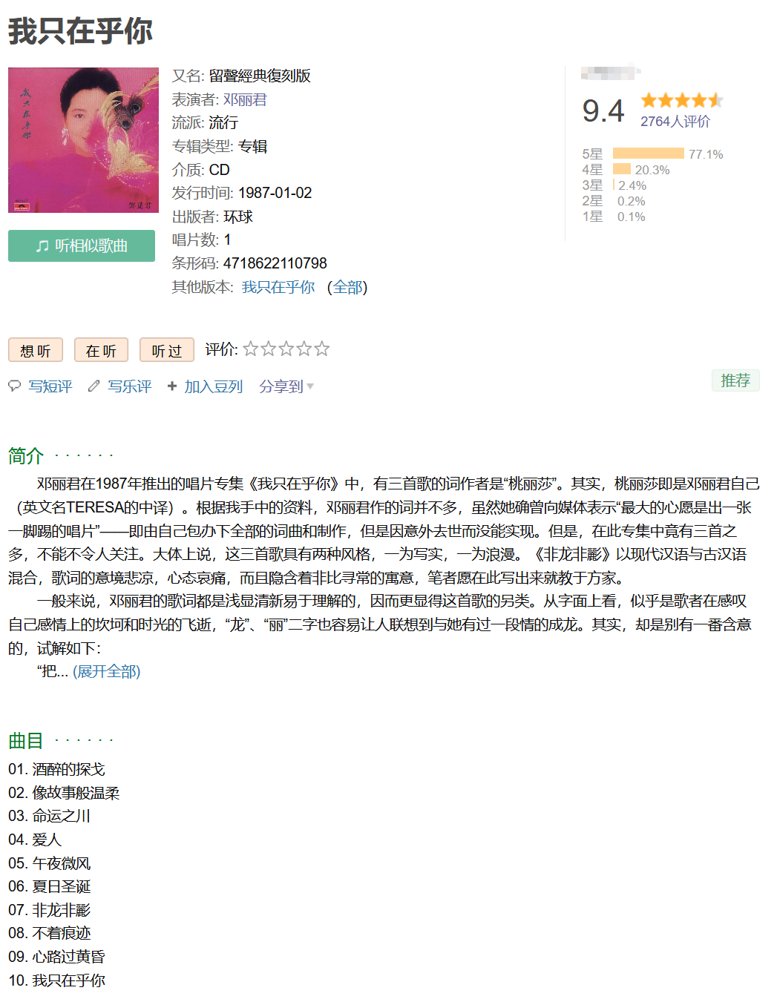
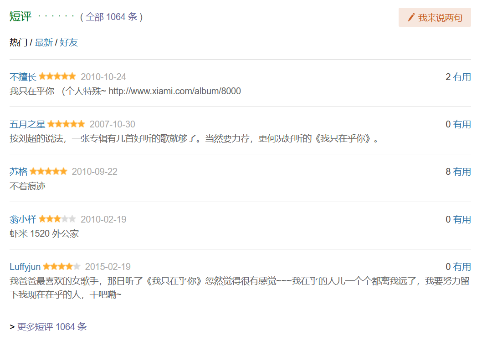
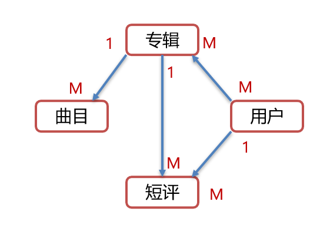

某瓣音乐

分析

音乐专辑表名：Music 

| 字段名       | 数据类型      | 说明                               |
| ------------ | ------------- | ---------------------------------- |
| title        | varchar(32)   | 专辑名                             |
| alias        | varchar(32)   | 专辑别名                           |
| image        | varchar(64)   | 封面图片                           |
| style        | varchar(8)    | 流派（如经典、流行、民谣、电子等） |
| type         | varchar(4)    | 类型（专辑、单曲等）               |
| medium       | varchar(4)    | 介质（CD、黑胶、数字等）           |
| publish_time | date          | 发行时间                           |
| publisher    | varchar(16)   | 出版者                             |
| number       | tinyint       | 唱片数                             |
| barcode      | bigint        | 条形码                             |
| summary      | varchar(1024) | 简介                               |
| artist       | varchar(16)   | 艺术家                             |
| id           | int           | 编号（唯一）                       |

曲目表名： Song

| 字段名        | 数据类型    | 说明                 |
| ------------- | ----------- | -------------------- |
| name          | varchar(32) | 歌曲名               |
| serial_number | tinyint     | 歌曲序号             |
| id            | int         | 编号（唯一）         |

评论表名：Review

| 字段名      | 数据类型     | 说明                 |
| ----------- | ------------ | -------------------- |
| content     | varchar(256) | 评论内容             |
| rating      | tinyint      | 评分（1~5）          |
| review_time | datetime     | 评论时间             |

用户表名：User

| 字段名    | 数据类型    | 说明                                    |
| --------- | ----------- | --------------------------------------- |
| username  | varchar(16) | 用户名（唯一）                          |
| image     | varchar(64) | 用户头像图片地址                        |
| signature | varchar(64) | 个人签名，例如（万般各所是 一切皆圆满） |
| nickname  | varchar(16) | 用户昵称                                |
| id        | int         | 用户编号(主键)                           |

表关系：

