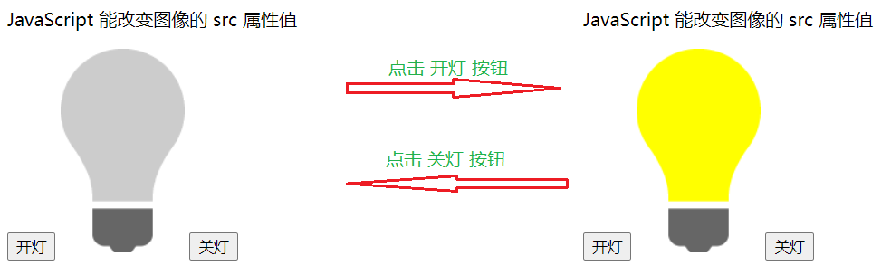
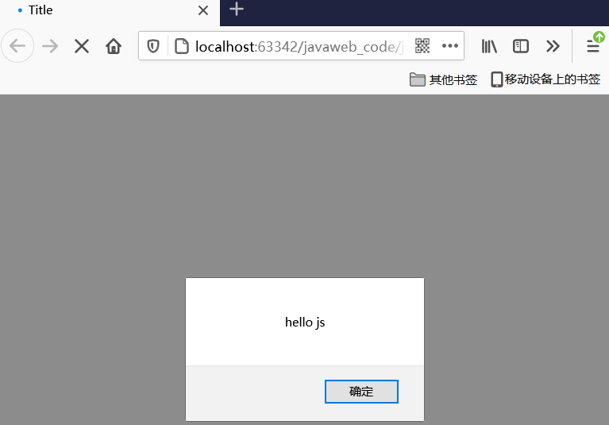
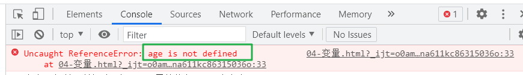
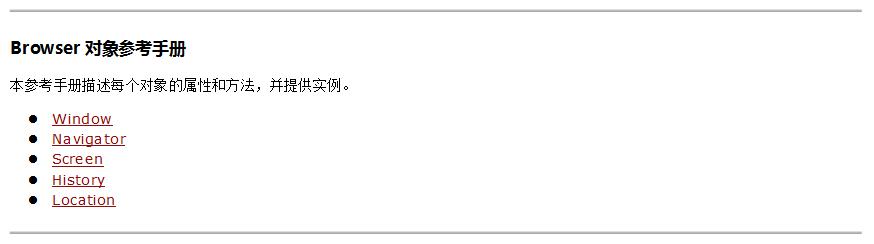
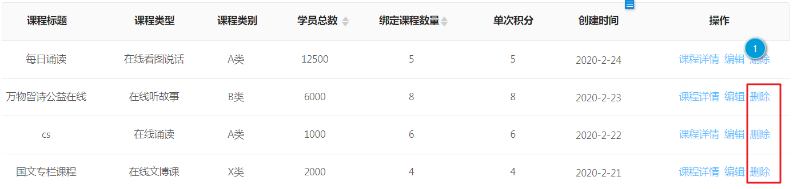
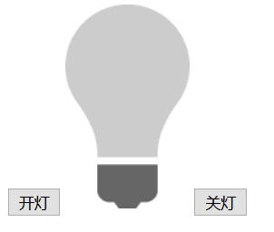
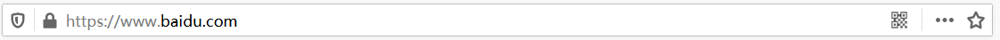
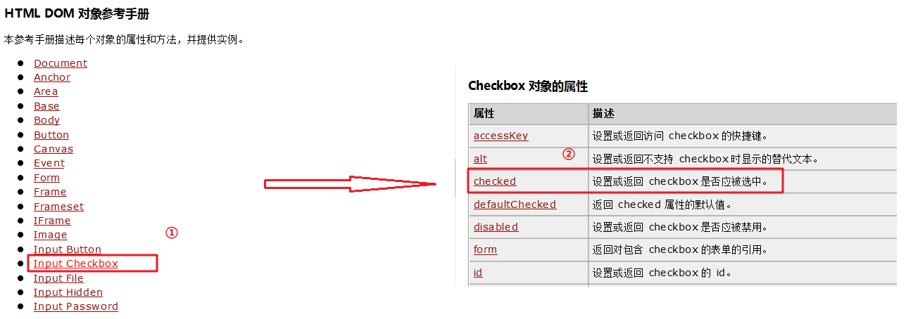
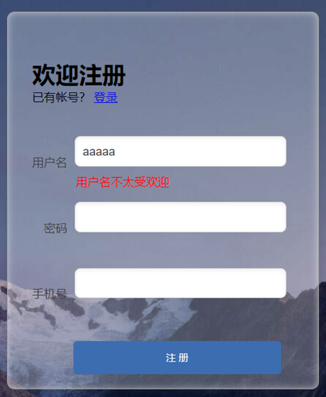

## JavaScript

**今日目标**

> * 掌握 JavaScript 的基础语法
> * 掌握 JavaScript 的常用对象（Array、String）
> * 能根据需求灵活运用定时器及通过 js 代码进行页面跳转
> * 能通过DOM 对象对标签进行常规操作
> * 掌握常用的事件
> * 能独立完成表单校验案例

## 1，JavaScript简介

==JavaScript 是一门跨平台、面向对象的脚本语言==，而Java语言也是跨平台的、面向对象的语言，只不过Java是编译语言，是需要编译成字节码文件才能运行的；JavaScript是脚本语言，不需要编译，由浏览器直接解析并执行。

JavaScript 是用来控制网页行为的，它能使网页可交互；那么它可以做什么呢？如改变页面内容、修改指定元素的属性值、对表单进行校验等，下面是这些功能的效果展示：

* **改变页面内容**

  

  当我点击上面左图的 `点击我` 按钮，按钮上面的文本就改为上面右图内容，这就是js 改变页面内容的功能。

* **修改指定元素的属性值**

  

  当我们点击上图的 `开灯` 按钮，效果就是上面右图效果；当我点击 `关灯` 按钮，效果就是上面左图效果。其他这个功能中有两张灯泡的图片（使用img标签进行展示），通过修改 img 标签的 src 属性值改变展示的图片来实现。

* **对表单进行校验**

  

  在上面左图的输入框输入用户名，如果输入的用户名是不满足规则的就展示右图(上) 的效果；如果输入的用户名是满足规则的就展示右图(下) 的效果。

JavaScript 和 Java 是完全不同的语言，不论是概念还是设计，只是名字比较像而已。但是==基础语法类似==，所以我们有java的学习经验，再学习JavaScript 语言就相对比较容易些。

JavaScript（简称：JS） 在 1995 年由 Brendan Eich 发明，并于 1997 年成为一部 ECMA 标准。ECMA 规定了一套标准 就叫 `ECMAScript` ，所有的客户端校验语言必须遵守这个标准，当然 JavaScript 也遵守了这个标准。ECMAScript 6 (简称ES6) 是最新的 JavaScript 版本（发布于 2015 年)，我们的课程就是基于最新的 `ES6` 进行讲解。

## 2，JavaScript引入方式

JavaScript 引入方式就是 HTML 和 JavaScript 的结合方式。JavaScript引入方式有两种：

* 内部脚本：将 JS代码定义在HTML页面中
* 外部脚本：将 JS代码定义在外部 JS文件中，然后引入到 HTML页面中

### 2.1  内部脚本

在 HTML 中，JavaScript 代码必须位于 `<script>` 与 `</script>` 标签之间

**代码如下：**

`alert(数据)` 是 JavaScript 的一个方法，作用是将参数数据以浏览器弹框的形式输出出来。

```html
<!DOCTYPE html>
<html lang="en">
<head>
    <meta charset="UTF-8">
    <title>Title</title>
</head>
<body>

<script>
    alert("hello js1");
</script>
</body>
</html>
```

**效果如下：**



从结果可以看到 js 代码已经执行了。

> ==提示：==
>
> * 在 HTML 文档中可以在任意地方，放置任意数量的<script>标签。如下图
>
>   ```html
>   <!DOCTYPE html>
>   <html lang="en">
>   <head>
>       <meta charset="UTF-8">
>       <title>Title</title>
>       <script>
>           alert("hello js1");
>       </script>
>   </head>
>   <body>
>       
>   <script>
>       alert("hello js1");
>   </script>
>       
>   </body>
>   </html>
>   <script>
>       alert("hello js1");
>   </script>
>   ```
>
> * 一般把脚本置于 <body> 元素的底部，可改善显示速度
>
>   因为浏览器在加载页面的时候会从上往下进行加载并解析。 我们应该让用户看到页面内容，然后再展示动态的效果。

### 2.2  外部脚本

**第一步：定义外部 js 文件。如定义名为 demo.js的文件**

项目结构如下：


demo.js 文件内容如下：

```js
alert("hello js");
```

**第二步：在页面中引入外部的js文件**

在页面使用 `script` 标签中使用 `src` 属性指定 js 文件的 URL 路径。

```html
<!DOCTYPE html>
<html lang="en">
<head>
    <meta charset="UTF-8">
    <title>Title</title>
</head>
<body>

<script src="../js/demo.js"></script>
</body>
</html>
```

> ==注意：==
>
> * 外部脚本不能包含 `<script>` 标签
>
>   在js文件中直接写 js 代码即可，不要在 js文件 中写 `script` 标签
>
> * `<script>` 标签不能自闭合
>
>   在页面中引入外部js文件时，不能写成 `<script src="../js/demo.js" />`。

## 3，JavaScript基础语法

### 3.1  书写语法

* 区分大小写：与 Java 一样，变量名、函数名以及其他一切东西都是区分大小写的

* 每行结尾的分号可有可无

  如果一行上写多个语句时，必须加分号用来区分多个语句。

* 注释

  * 单行注释：// 注释内容
  * 多行注释：/* 注释内容 */

  > 注意：JavaScript 没有文档注释

* 大括号表示代码块

  下面语句大家肯定能看懂，和 java 一样 大括号表示代码块。

  ```js
  if (count == 3) { 
     alert(count); 
  } 
  ```

### 3.2  输出语句

js 可以通过以下方式进行内容的输出，只不过不同的语句输出到的位置不同

* **使用 window.alert() 写入警告框**

  ```html
  <!DOCTYPE html>
  <html lang="en">
  <head>
      <meta charset="UTF-8">
      <title>Title</title>
  </head>
  <body>
      
  <script>
      window.alert("hello js");//写入警告框
  </script>
  </body>
  </html>
  ```

  上面代码通过浏览器打开，我们可以看到如下图弹框效果

  

* **使用 document.write() 写入 HTML 输出**

  ```html
  <!DOCTYPE html>
  <html lang="en">
  <head>
      <meta charset="UTF-8">
      <title>Title</title>
  </head>
  <body>
      
  <script>
      document.write("hello js 2~");//写入html页面
  </script>
  </body>
  </html>
  ```

  上面代码通过浏览器打开，我们可以在页面上看到 `document.write(内容)` 输出的内容

  

* **使用 console.log() 写入浏览器控制台**

  ```html
  <!DOCTYPE html>
  <html lang="en">
  <head>
      <meta charset="UTF-8">
      <title>Title</title>
  </head>
  <body>
  
  <script>
      console.log("hello js 3");//写入浏览器的控制台
  </script>
  </body>
  </html>
  ```

  上面代码通过浏览器打开，我们可以在不能页面上看到  `console.log(内容)` 输出的内容，它是输出在控制台了，而怎么在控制台查看输出的内容呢？在浏览器界面按 `F12` 就可以看到下图的控制台

  

### 3.3  变量

JavaScript 中用 var 关键字（variable 的缩写）来声明变量。格式 `var 变量名 = 数据值;`。而在JavaScript 是一门弱类型语言，变量==可以存放不同类型的值==；如下在定义变量时赋值为数字数据，还可以将变量的值改为字符串类型的数

```js
var test = 20;
test = "张三";
```

js 中的变量名命名也有如下规则，和java语言基本都相同

* 组成字符可以是任何字母、数字、下划线（_）或美元符号（$）
* 数字不能开头
* 建议使用驼峰命名

JavaScript 中 `var` 关键字有点特殊，有以下地方和其他语言不一样

* 作用域：全局变量

  ```js
  {
      var age = 20;
  }
  alert(age);  // 在代码块中定义的age 变量，在代码块外边还可以使用
  ```

* 变量可以重复定义

  ```js
  {
      var age = 20;
      var age = 30;//JavaScript 会用 30 将之前 age 变量的 20 替换掉
  }
  alert(age); //打印的结果是 30
  ```

针对如上的问题，==ECMAScript 6 新增了 `let `关键字来定义变量。==它的用法类似于 `var`，但是所声明的变量，只在 `let` 关键字所在的代码块内有效，且不允许重复声明。

例如：

```js
{
    let age = 20;
}
alert(age); 
```

运行上面代码，浏览器并没有弹框输出结果，说明这段代码是有问题的。通过 `F12` 打开开发者模式可以看到如下错误信息



而如果在代码块中定义两个同名的变量，IDEA 开发工具就直接报错了

> 

==ECMAScript 6 新增了 const关键字，用来声明一个只读的常量。一旦声明，常量的值就不能改变。== 通过下面的代码看一下常用的特点就可以了

> 

我们可以看到给 PI 这个常量重新赋值时报错了。

### 3.4  数据类型

JavaScript 中提供了两类数据类型：原始类型 和 引用类型。

> 使用 typeof 运算符可以获取数据类型
>
> `alert(typeof age);` 以弹框的形式将 age 变量的数据类型输出

原始数据类型：

* **number**：数字（整数、小数、NaN(Not a Number)）

  ```js
  var age = 20;
  var price = 99.8;
  
  alert(typeof age); // 结果是 ： number
  alert(typeof price);// 结果是 ： number
  ```

  > ==注意：== NaN是一个特殊的number类型的值，后面用到再说

* **string**：字符、字符串，单双引皆可

  ```js
  var ch = 'a';
  var name = '张三'; 
  var addr = "北京";
  
  alert(typeof ch); //结果是  string
  alert(typeof name); //结果是  string
  alert(typeof addr); //结果是  string
  ```

  > ==注意：==在 js 中 双引号和单引号都表示字符串类型的数据

* **boolean**：布尔。true，false

  ```js
  var flag = true;
  var flag2 = false;
  
  alert(typeof flag); //结果是 boolean
  alert(typeof flag2); //结果是 boolean
  ```

* **null**：对象为空

  ```js
  var obj = null;
  
  alert(typeof obj);//结果是 object
  ```

  为什么打印上面的 obj 变量的数据类型，结果是object；这个官方给出了解释，下面是从官方文档截的图

  

* **undefined**：当声明的变量未初始化时，该变量的默认值是 undefined

  ```js
  var a ;
  alert(typeof a); //结果是 undefined
  ```

### 3.5  运算符

JavaScript 提供了如下的运算符。大部分和 Java语言 都是一样的，不同的是 JS 关系运算符中的 `==` 和 `===`，一会我们只演示这两个的区别，其他运算符将不做演示

* 一元运算符：++，--

* 算术运算符：+，-，*，/，%

* 赋值运算符：=，+=，-=…

* 关系运算符：>，<，>=，<=，!=，\==，===…

* 逻辑运算符：&&，||，!

* 三元运算符：条件表达式 ? true_value : false_value 

#### 3.5.1  \==和===区别

**概述:**

* ==：

  1. 判断类型是否一样，如果不一样，则进行类型转换

  2. 再去比较其值

* ===：js 中的全等于

  1. 判断类型是否一样，如果不一样，直接返回false
  2. 再去比较其值

**代码：**

```js
var age1 = 20;
var age2 = "20";

alert(age1 == age2);// true
alert(age1 === age2);// false
```

#### 3.5.2  类型转换

上述讲解 `==` 运算符时，发现会进行类型转换，所以接下来我们来详细的讲解一下 JavaScript 中的类型转换。

* 其他类型转为number

  * string 转换为 number 类型：按照字符串的字面值，转为数字。如果字面值不是数字，则转为NaN

    将 string 转换为 number 有两种方式：

    * 使用 `+` 正号运算符：

      ```js
      var str = +"20";
      alert(str + 1) //21
      ```

    * 使用 `parseInt()` 函数(方法)：

      ```js
      var str = "20";
      alert(parseInt(str) + 1);
      ```

    > ==建议使用 `parseInt()` 函数进行转换。==

  * boolean 转换为 number 类型：true 转为1，false转为0

    ```js
    var flag = +false;
    alert(flag); // 0
    ```

* 其他类型转为boolean

  * number 类型转换为 boolean 类型：0和NaN转为false，其他的数字转为true
  * string 类型转换为 boolean 类型：空字符串转为false，其他的字符串转为true
  * null类型转换为 boolean 类型是 false
  * undefined 转换为 boolean 类型是 false

  **代码如下：**

  ```js
  // var flag = 3;
  // var flag = "";
  var flag = undefined;
  
  if(flag){
      alert("转为true");
  }else {
      alert("转为false");
  }
  ```

**使用场景：**

在 Java 中使用字符串前，一般都会先判断字符串不是null，并且不是空字符才会做其他的一些操作，JavaScript也有类型的操作，代码如下：

```js
var str = "abc";

//健壮性判断
if(str != null && str.length > 0){
    alert("转为true");
}else {
    alert("转为false");
}
```

但是由于 JavaScript 会自动进行类型转换，所以上述的判断可以进行简化，代码如下：

```js
var str = "abc";

//健壮性判断
if(str){
    alert("转为true");
}else {
    alert("转为false");
}
```


### 3.6  流程控制语句

JavaScript 中提供了和 Java 一样的流程控制语句，如下

* if 
* switch
* for
* while
* dowhile

#### 3.6.1  if 语句

```js
var count = 3;
if (count == 3) {
    alert(count);
}
```

#### 3.6.2  switch 语句

```js
var num = 3;
switch (num) {
    case 1:
        alert("星期一");
        break;
    case 2:
        alert("星期二");
        break;
    case 3:
        alert("星期三");
        break;
    case 4:
        alert("星期四");
        break;
    case 5:
        alert("星期五");
        break;
    case 6:
        alert("星期六");
        break;
    case 7:
        alert("星期日");
        break;
    default:
        alert("输入的星期有误");
        break;
}
```

#### 3.6.3  for 循环语句

```js
var sum = 0;
for (let i = 1; i <= 100; i++) { //建议for循环小括号中定义的变量使用let
    sum += i;
}
alert(sum);
```

#### 3.6.4  while 循环语句

```js
var sum = 0;
var i = 1;
while (i <= 100) {
    sum += i;
    i++;
}
alert(sum);
```

#### 3.6.5  dowhile 循环语句

```js
var sum = 0;
var i = 1;
do {
    sum += i;
    i++;
}
while (i <= 100);
alert(sum);
```

### 3.7  函数

函数（就是Java中的方法）是被设计为执行特定任务的代码块；JavaScript 函数通过 function 关键词进行定义。

#### 3.7.1  定义格式

函数定义格式有两种：

* 方式1

  ```js
  function 函数名(参数1,参数2..){
      要执行的代码
  }
  ```

* 方式2

  ```js
  var 函数名 = function (参数列表){
      要执行的代码
  }
  ```

> ==注意：==
>
> * 形式参数不需要类型。因为JavaScript是弱类型语言
>
>   ```js
>   function add(a, b){
>       return a + b;
>   }
>   ```
>
>   上述函数的参数 a 和 b 不需要定义数据类型，因为在每个参数前加上 var 也没有任何意义。
>
> * 返回值也不需要定义类型，可以在函数内部直接使用return返回即可

#### 3.7.2  函数调用

函数调用函数：

```js
函数名称(实际参数列表);
```

eg：

```js
let result = add(10,20);
```

> ==注意：==
>
> * JS中，函数调用可以传递任意个数参数
>
> * 例如  `let result = add(1,2,3);` 
>
>   它是将数据 1 传递给了变量a，将数据 2 传递给了变量 b，而数据 3 没有变量接收。

## 4，JavaScript常用对象

JavaScript 提供了很多对象供使用者来使用。这些对象总共分类三类

* 基本对象

  

* BOM 对象

  

* DOM对象

  DOM 中的对象就比较多了，下图只是截取部分

  

这小节我们先学习基本对象，而我们先学习 `Array` 数组对象和 `String` 字符串对象。

### 4.1  Array对象

JavaScript Array对象用于定义数组

#### 4.1.1  定义格式

数组的定义格式有两种：

* 方式1

  ```js
  var 变量名 = new Array(元素列表); 
  ```

  例如：

  ```js
  var arr = new Array(1,2,3); //1,2,3 是存储在数组中的数据（元素）
  ```

* 方式2

  ```js
  var 变量名 = [元素列表];
  ```

  例如：

  ```js
  var arr = [1,2,3]; //1,2,3 是存储在数组中的数据（元素）
  ```

  ==注意：Java中的数组静态初始化使用的是{}定义，而 JavaScript 中使用的是 [] 定义==

#### 4.1.2  元素访问

访问数组中的元素和 Java 语言的一样，格式如下：

```js
arr[索引] = 值;
```

**代码演示：**

```js
 // 方式一
var arr = new Array(1,2,3);
// alert(arr);

// 方式二
var arr2 = [1,2,3];
//alert(arr2);

// 访问
arr2[0] = 10;
alert(arr2)
```

#### 4.1.3  特点

JavaScript 中的数组相当于 Java 中集合。数组的长度是可以变化的，而 JavaScript 是弱类型，所以可以存储任意的类型的数据。

例如如下代码：

```js
// 变长
var arr3 = [1,2,3];
arr3[10] = 10;
alert(arr3[10]); // 10
alert(arr3[9]);  //undefined
```

上面代码在定义数组中给了三个元素，又给索引是 10 的位置添加了数据 10，那么 `索引3` 到 `索引9` 位置的元素是什么呢？我们之前就介绍了，在 JavaScript 中没有赋值的话，默认就是 `undefined`。

如果给 `arr3` 数组添加字符串的数据，也是可以添加成功的

```js
arr3[5] = "hello";
alert(arr3[5]); // hello
```

#### 4.1.4  属性

Array 对象提供了很多属性，如下图是官方文档截取的


而我们只讲解 `length` 属性，该数组可以动态的获取数组的长度。而有这个属性，我们就可以遍历数组了

```js
var arr = [1,2,3];
for (let i = 0; i < arr.length; i++) {
    alert(arr[i]);
}
```

#### 4.1.5  方法

Array 对象同样也提供了很多方法，如下图是官方文档截取的


而我们在课堂中只演示 `push` 函数和 `splice` 函数。

* push 函数：给数组添加元素，也就是在数组的末尾添加元素

  参数表示要添加的元素

  ```js
  // push:添加方法
  var arr5 = [1,2,3];
  arr5.push(10);
  alert(arr5);  //数组的元素是 {1,2,3,10}
  ```

* splice 函数：删除元素

  参数1：索引。表示从哪个索引位置删除

  参数2：个数。表示删除几个元素

  ```js
  // splice:删除元素
  var arr5 = [1,2,3];
  arr5.splice(0,1); //从 0 索引位置开始删除，删除一个元素 
  alert(arr5); // {2,3}
  ```

### 4.2  String对象

String对象的创建方式有两种

* 方式1：

  ```js
  var 变量名 = new String(s); 
  ```

* 方式2：

  ```js
  var 变量名 = "数组"; 
  ```

**属性：**

String对象提供了很多属性，下面给大家列举了一个属性 `length` ，该属性是用于动态的获取字符串的长度


**函数：**

String对象提供了很多函数（方法），下面给大家列举了两个方法。


String对象还有一个函数 `trim()` ，该方法在文档中没有体现，但是所有的浏览器都支持；它是用来去掉字符串两端的空格。

代码演示：

```js
var str4 = '  abc   ';
alert(1 + str4 + 1);
```

上面代码会输出内容 `1  abc  1`，很明显可以看到 abc 字符串左右两边是有空格的。接下来使用 `trim()` 函数

```js
var str4 = '  abc   ';
alert(1 + str4.trim() + 1);
```

输出的内容是 `1abc1` 。这就是 `trim()` 函数的作用。

`trim()` 函数在以后开发中还是比较常用的，例如下图所示是登陆界面

 

用户在输入用户名和密码时，可能会习惯的输入一些空格，这样在我们后端程序中判断用户名和密码是否正确，结果肯定是失败。所以我们一般都会对用户输入的字符串数据进行去除前后空格的操作。

### 4.3  自定义对象

在 JavaScript 中自定义对象特别简单，下面就是自定义对象的格式：

```js
var 对象名称 = {
    属性名称1:属性值1,
    属性名称2:属性值2,
    ...,
    函数名称:function (形参列表){},
	...
};
```

调用属性的格式：

```js
对象名.属性名
```

调用函数的格式：

```js
对象名.函数名()
```

接下来通过代码演示一下，让大家体验一下 JavaScript 中自定义对象

```js
var person = {
        name : "zhangsan",
        age : 23,
        eat: function (){
            alert("干饭~");
        }
    };


alert(person.name);  //zhangsan
alert(person.age); //23

person.eat();  //干饭~
```

## 5，BOM

BOM：Browser Object Model 浏览器对象模型。也就是 JavaScript 将浏览器的各个组成部分封装为对象。

我们要操作浏览器的各个组成部分就可以通过操作 BOM 中的对象来实现。比如：我现在想将浏览器地址栏的地址改为 `https://www.itheima.com` 就可以通过使用 BOM 中定义的 `Location` 对象的 `href` 属性，代码： `location.href = "https://itheima.com";` 

 BOM 中包含了如下对象：

* Window：浏览器窗口对象
* Navigator：浏览器对象
* Screen：屏幕对象
* History：历史记录对象
* Location：地址栏对象

下图是 BOM 中的各个对象和浏览器的各个组成部分的对应关系


BOM 中的 `Navigator` 对象和 `Screen` 对象基本不会使用，所以我们的课堂只对 `Window`、`History`、`Location` 对象进行讲解。

### 5.1  Window对象

window 对象是 JavaScript 对浏览器的窗口进行封装的对象。

#### 5.1.1  获取window对象

该对象不需要创建直接使用 `window`，其中 `window. ` 可以省略。比如我们之前使用的 `alert()` 函数，其实就是 `window` 对象的函数，在调用是可以写成如下两种

* 显式使用 `window` 对象调用

  ```js
  window.alert("abc");
  ```

* 隐式调用

  ```
  alert("abc")
  ```

#### 5.1.2  window对象属性

`window` 对象提供了用于获取其他 BOM 组成对象的属性


也就是说，我们想使用 `Location` 对象的话，就可以使用 `window` 对象获取；写成 `window.location`，而 `window.` 可以省略，简化写成 `location` 来获取 `Location` 对象。

#### 5.1.3  window对象函数

`window` 对象提供了很多函数供我们使用，而很多都不常用；下面给大家列举了一些比较常用的函数


> `setTimeout(function,毫秒值)` : 在一定的时间间隔后执行一个function，只执行一次
> `setInterval(function,毫秒值)` :在一定的时间间隔后执行一个function，循环执行

**confirm代码演示：**

```js
// confirm()，点击确定按钮，返回true，点击取消按钮，返回false
var flag = confirm("确认删除？");

alert(flag);
```

下图是 `confirm()` 函数的效果。当我们点击 `确定` 按钮，`flag` 变量值记录的就是 `true` ；当我们点击 `取消` 按钮，`flag` 变量值记录的就是 `false`。


而以后我们在页面删除数据时候如下图每一条数据后都有 `删除` 按钮，有可能是用户的一些误操作，所以对于删除操作需要用户进行再次确认，此时就需要用到 `confirm()` 函数。



**定时器代码演示：**

```js
setTimeout(function (){
    alert("hehe");
},3000);
```

当我们打开浏览器，3秒后才会弹框输出 `hehe`，并且只会弹出一次。

```js
setInterval(function (){
    alert("hehe");
},2000);
```

当我们打开浏览器，每隔2秒都会弹框输出 `hehe`。

#### 5.1.4  案例

**需求：每隔1秒，灯泡切换一次状态**


需求说明：

有如下页面效果，实现定时进行开灯、关灯功能



初始页面环境

```html
<!DOCTYPE html>
<html lang="en">
<head>
    <meta charset="UTF-8">
    <title>JavaScript演示</title>
</head>
<body>

<input type="button" onclick="on()" value="开灯">

<input type="button" onclick="off()" value="关灯">

<script>
    function on(){
        document.getElementById('myImage').src='../imgs/on.gif';
    }

    function off(){
        document.getElementById('myImage').src='../imgs/off.gif'
    }

</script>
</body>
</html>
```

代码实现：

```html
<!DOCTYPE html>
<html lang="en">
<head>
    <meta charset="UTF-8">
    <title>JavaScript演示</title>
</head>
<body>

<input type="button" onclick="on()" value="开灯">

<input type="button" onclick="off()" value="关灯">

<script>
    function on(){
        document.getElementById('myImage').src='../imgs/on.gif';
    }

    function off(){
        document.getElementById('myImage').src='../imgs/off.gif'
    }
    
    //定义一个变量，用来记录灯的状态，偶数是开灯状态，奇数是关灯状态
    var x = 0;
    //使用循环定时器
    setInterval(function (){
        if(x % 2 == 0){//表示是偶数，开灯状态，调用 on() 函数
            on();
        }else {  //表示是奇数，关灯状态，调用 off() 函数
            off();
        }
        x ++;//改变变量的值
    },1000);

</script>
</body>
</html>
```

### 5.2  History对象

History 对象是 JavaScript 对历史记录进行封装的对象。

* History 对象的获取

  使用 window.history获取，其中window. 可以省略

* History 对象的函数

  

  这两个函数我们平时在访问其他的一些网站时经常使用对应的效果，如下图

  

  当我们点击向左的箭头，就跳转到前一个访问的页面，这就是 `back()` 函数的作用；当我们点击向右的箭头，就跳转到下一个访问的页面，这就是 `forward()` 函数的作用。

### 5.3  Location对象



Location 对象是 JavaScript 对地址栏封装的对象。可以通过操作该对象，跳转到任意页面。

#### 5.3.1  获取Location对象

使用 window.location获取，其中window. 可以省略

```js
window.location.方法();
location.方法();
```


#### 5.3.2  Location对象属性

Location对象提供了很对属性。以后常用的只有一个属性 `href`


**代码演示：**

```js
alert("要跳转了");
location.href = "https://www.baidu.com";
```

在浏览器首先会弹框显示 `要跳转了`，当我们点击了 `确定` 就会跳转到 百度 的首页。


#### 5.3.3  案例

**需求：3秒跳转到百度首页**

**分析：**

1. 3秒跳转，由此可以确定需要使用到定时器，而只跳转一次，所以使用 `setTimeOut()`
2. 要进行页面跳转，所以需要用到 `location` 对象的 `href` 属性实现

**代码实现：**

```js
document.write("3秒跳转到首页..."); 
setTimeout(function (){
    location.href = "https://www.baidu.com"
},3000);
```

## 6，DOM

### 6.1  概述

DOM：Document Object Model 文档对象模型。也就是 JavaScript 将 HTML 文档的各个组成部分封装为对象。

DOM 其实我们并不陌生，之前在学习 XML 就接触过，只不过 XML 文档中的标签需要我们写代码解析，而 HTML 文档是浏览器解析。封装的对象分为

* Document：整个文档对象
* Element：元素对象
* Attribute：属性对象
* Text：文本对象
* Comment：注释对象

如下图，左边是 HTML 文档内容，右边是 DOM 树


**作用：**

JavaScript 通过 DOM， 就能够对 HTML进行操作了

* 改变 HTML 元素的内容
* 改变 HTML 元素的样式（CSS）
* 对 HTML DOM 事件作出反应
* 添加和删除 HTML 元素

**DOM相关概念：**

DOM 是 W3C（万维网联盟）定义了访问 HTML 和 XML 文档的标准。该标准被分为 3 个不同的部分：

1. 核心 DOM：针对任何结构化文档的标准模型。 XML 和 HTML 通用的标准

   * Document：整个文档对象

   * Element：元素对象

   * Attribute：属性对象

   * Text：文本对象

   * Comment：注释对象

2. XML DOM： 针对 XML 文档的标准模型

3. HTML DOM： 针对 HTML 文档的标准模型

   该标准是在核心 DOM 基础上，对 HTML 中的每个标签都封装成了不同的对象

   * 例如：`` 标签在浏览器加载到内存中时会被封装成 `Image` 对象，同时该对象也是 `Element` 对象。
   * 例如：`<input type='button'>` 标签在浏览器加载到内存中时会被封装成 `Button` 对象，同时该对象也是 `Element` 对象。

### 6.2  获取 Element对象

HTML 中的 Element 对象可以通过 `Document` 对象获取，而 `Document` 对象是通过 `window` 对象获取。

`Document` 对象中提供了以下获取 `Element` 元素对象的函数

* `getElementById()`：根据id属性值获取，返回单个Element对象
* `getElementsByTagName()`：根据标签名称获取，返回Element对象数组
* `getElementsByName()`：根据name属性值获取，返回Element对象数组
* `getElementsByClassName()`：根据class属性值获取，返回Element对象数组

**代码演示：**

下面有提前准备好的页面：

```html
<!DOCTYPE html>
<html lang="en">
<head>
    <meta charset="UTF-8">
    <title>Title</title>
</head>
<body>
     <br>

    <div class="cls">传智教育</div>   <br>
    <div class="cls">黑马程序员</div> <br>

    <input type="checkbox" name="hobby"> 电影
    <input type="checkbox" name="hobby"> 旅游
    <input type="checkbox" name="hobby"> 游戏
    <br>
    <script>
		//在此处书写js代码
    </script>
</body>
</html>
```

1. 根据 `id` 属性值获取上面的 `img` 元素对象，返回单个对象

   ```js
   var img = document.getElementById("light");
   alert(img);
   ```

   结果如下：

   

   从弹框输出的内容，也可以看出是一个图片元素对象。

2. 根据标签名称获取所有的 `div` 元素对象

   ```js
   var divs = document.getElementsByTagName("div");// 返回一个数组，数组中存储的是 div 元素对象
   // alert(divs.length);  //输出 数组的长度
   //遍历数组
   for (let i = 0; i < divs.length; i++) {
       alert(divs[i]);
   }
   ```

3. 获取所有的满足 `name = 'hobby'` 条件的元素对象

   ```js
   //3. getElementsByName：根据name属性值获取，返回Element对象数组
   var hobbys = document.getElementsByName("hobby");
   for (let i = 0; i < hobbys.length; i++) {
       alert(hobbys[i]);
   }
   ```

4. 获取所有的满足 `class='cls'` 条件的元素对象

   ```js
   //4. getElementsByClassName：根据class属性值获取，返回Element对象数组
   var clss = document.getElementsByClassName("cls");
   for (let i = 0; i < clss.length; i++) {
       alert(clss[i]);
   }
   ```

### 6.3  HTML Element对象使用

HTML 中的 `Element` 元素对象有很多，不可能全部记住，以后是根据具体的需求查阅文档使用。

下面我们通过具体的案例给大家演示文档的查询和对象的使用；下面提前给大家准备好的页面

```html
<!DOCTYPE html>
<html lang="en">
<head>
    <meta charset="UTF-8">
    <title>Title</title>
</head>
<body>
     <br>

    <div class="cls">传智教育</div>   <br>
    <div class="cls">黑马程序员</div> <br>

    <input type="checkbox" name="hobby"> 电影
    <input type="checkbox" name="hobby"> 旅游
    <input type="checkbox" name="hobby"> 游戏
    <br>
    <script>
        //在此处写js低吗
    </script>
</body>
</html>
```

**需求：**

1. 点亮灯泡

   此案例由于需要改变 `img` 标签 的图片，所以我们查询文档，下图是查看文档的流程：

   

   代码实现：

   ```js
   //1，根据 id='light' 获取 img 元素对象
   var img = document.getElementById("light");
   //2，修改 img 对象的 src 属性来改变图片
   img.src = "../imgs/on.gif";
   ```

2. 将所有的 `div` 标签的标签体内容替换为 `呵呵`

   ```js
   //1，获取所有的 div 元素对象
   var divs = document.getElementsByTagName("div");
   /*
           style:设置元素css样式
           innerHTML：设置元素内容
       */
   //2，遍历数组，获取到每一个 div 元素对象，并修改元素内容
   for (let i = 0; i < divs.length; i++) {
       //divs[i].style.color = 'red';
       divs[i].innerHTML = "呵呵";
   }
   ```

3. 使所有的复选框呈现被选中的状态

   此案例我们需要看 复选框 元素对象有什么属性或者函数是来操作 复选框的选中状态。下图是文档的查看

   

   代码实现：

   ```js
   //1，获取所有的 复选框 元素对象
   var hobbys = document.getElementsByName("hobby");
   //2，遍历数组，通过将 复选框 元素对象的 checked 属性值设置为 true 来改变复选框的选中状态
   for (let i = 0; i < hobbys.length; i++) {
       hobbys[i].checked = true;
   }
   ```

## 7，事件监听

要想知道什么是事件监听，首先先聊聊什么是事件？

HTML 事件是发生在 HTML 元素上的“事情”。比如：页面上的 `按钮被点击`、`鼠标移动到元素之上`、`按下键盘按键` 等都是事件。

事件监听是JavaScript 可以在事件被侦测到时==执行一段逻辑代码。==例如下图当我们点击 `开灯` 按钮，就需要通过 js 代码实现替换图片


再比如下图输入框，当我们输入了用户名 `光标离开` 输入框，就需要通过 js 代码对输入的内容进行校验，没通过校验就在输入框后提示 `用户名格式有误!`


### 7.1  事件绑定

JavaScript 提供了两种事件绑定方式：

* 方式一：通过 HTML标签中的事件属性进行绑定

  如下面代码，有一个按钮元素，我们是在该标签上定义 `事件属性`，在事件属性中绑定函数。`onclick` 就是 `单击事件` 的事件属性。`onclick='on（）'` 表示该点击事件绑定了一个名为 `on()` 的函数

  ```html
  <input type="button" onclick='on()’>
  ```

  下面是点击事件绑定的 `on()` 函数

  ```js
  function on(){
  	alert("我被点了");
  }
  ```

* 方式二：通过 DOM 元素属性绑定

  如下面代码是按钮标签，在该标签上我们并没有使用 `事件属性`，绑定事件的操作需要在 js 代码中实现

  ```html
  <input type="button" id="btn">
  ```

  下面 js 代码是获取了 `id='btn'` 的元素对象，然后将 `onclick` 作为该对象的属性，并且绑定匿名函数。该函数是在事件触发后自动执行

  ```js
  document.getElementById("btn").onclick = function (){
      alert("我被点了");
  }
  ```

**代码演示：**

```html
<!DOCTYPE html>
<html lang="en">
<head>
    <meta charset="UTF-8">
    <title>Title</title>
</head>
<body>
    <!--方式1：在下面input标签上添加 onclick 属性，并绑定 on() 函数-->
    <input type="button" value="点我" onclick="on()"> <br>
    <input type="button" value="再点我" id="btn">

    <script>
        function on(){
            alert("我被点了");
        }
      	//方式2：获取 id="btn" 元素对象，通过调用 onclick 属性 绑定点击事件
        document.getElementById("btn").onclick = function (){
            alert("我被点了");
        }
    </script>
</body>
</html>
```

### 7.2  常见事件

上面案例中使用到了 `onclick` 事件属性，那都有哪些事件属性供我们使用呢？下面就给大家列举一些比较常用的事件属性

| 事件属性名  | 说明                     |
| ----------- | ------------------------ |
| onclick     | 鼠标单击事件             |
| onblur      | 元素失去焦点             |
| onfocus     | 元素获得焦点             |
| onload      | 某个页面或图像被完成加载 |
| onsubmit    | 当表单提交时触发该事件   |
| onmouseover | 鼠标被移到某元素之上     |
| onmouseout  | 鼠标从某元素移开         |

* `onfocus` 获得焦点事件。

  如下图，当点击了输入框后，输入框就获得了焦点。而下图示例是当获取焦点后会更改输入框的背景颜色。

  

* `onblur  ` 失去焦点事件。

  如下图，当点击了输入框后，输入框就获得了焦点；再点击页面其他位置，那输入框就失去焦点了。下图示例是将输入的文本转换为大写。

  

* `onmouseout  ` 鼠标移出事件。

* `onmouseover  `  鼠标移入事件。

  如下图，当鼠标移入到 苹果 图片上时，苹果图片变大；当鼠标移出 苹果图片时，苹果图片变小。

  

* `onsubmit  ` 表单提交事件

  如下是带有表单的页面

  ```html
  <!DOCTYPE html>
  <html lang="en">
  <head>
      <meta charset="UTF-8">
      <title>Title</title>
  </head>
  <body>
      <form id="register" action="#" >
          <input type="text" name="username" />
          <input type="submit" value="提交">
      </form>
      <script>
          
      </script>
  </body>
  </html>
  ```

  如上代码的表单，当我们点击 `提交` 按钮后，表单就会提交，此处默认使用的是 `GET` 提交方式，会将提交的数据拼接到 URL 后。现需要通过 js 代码实现阻止表单提交的功能，js 代码实现如下：

  1. 获取 `form` 表单元素对象。
  2. 给 `form` 表单元素对象绑定 `onsubmit` 事件，并绑定匿名函数。
  3. 该匿名函数如果返回的是true，提交表单；如果返回的是false，阻止表单提交。

  ```js
  document.getElementById("register").onsubmit = function (){
      //onsubmit 返回true，则表单会被提交，返回false，则表单不提交
      return true;
  }
  ```

## 8，表单验证案例

### 8.1  需求



有如下注册页面，对表单进行校验，如果输入的用户名、密码、手机号符合规则，则允许提交；如果不符合规则，则不允许提交。

完成以下需求：

1. 当输入框失去焦点时，验证输入内容是否符合要求

2. 当点击注册按钮时，判断所有输入框的内容是否都符合要求，如果不合符则阻止表单提交

### 8.2  环境准备

下面是初始页面

```html
<!DOCTYPE html>
<html lang="en">
<head>
    <meta charset="UTF-8">
    <title>欢迎注册</title>
    <link href="../css/register.css" rel="stylesheet">
</head>
<body>
    <div class="form-div">
        <div class="reg-content">
            <h1>欢迎注册</h1>
            <span>已有帐号？</span> <a href="#">登录</a>
        </div>
        <form id="reg-form" action="#" method="get">
            <table>
                <tr>
                    <td>用户名</td>
                    <td class="inputs">
                        <input name="username" type="text" id="username">
                        <br>
                        <span id="username_err" class="err_msg" style="display: none">用户名不太受欢迎</span>
                    </td>
                </tr>

                <tr>
                    <td>密码</td>
                    <td class="inputs">
                        <input name="password" type="password" id="password">
                        <br>
                        <span id="password_err" class="err_msg" style="display: none">密码格式有误</span>
                    </td>
                </tr>

                <tr>
                    <td>手机号</td>
                    <td class="inputs"><input name="tel" type="text" id="tel">
                        <br>
                        <span id="tel_err" class="err_msg" style="display: none">手机号格式有误</span>
                    </td>
                </tr>
            </table>
            <div class="buttons">
                <input value="注 册" type="submit" id="reg_btn">
            </div>
            <br class="clear">
        </form>

    </div>


    <script>

    </script>
</body>
</html>
```

### 8.3  验证输入框

此小节完成如下功能：

* 校验用户名。当用户名输入框失去焦点时，判断输入的内容是否符合 `长度是 6-12 位` 规则，不符合使 `id='username_err'` 的span标签显示出来，给出用户提示。
* 校验密码。当密码输入框失去焦点时，判断输入的内容是否符合 `长度是 6-12 位` 规则，不符合使 `id='password_err'` 的span标签显示出来，给出用户提示。
* 校验手机号。当手机号输入框失去焦点时，判断输入的内容是否符合 `长度是 11 位` 规则，不符合使 `id='tel_err'` 的span标签显示出来，给出用户提示。

代码如下：

```js
//1. 验证用户名是否符合规则
//1.1 获取用户名的输入框
var usernameInput = document.getElementById("username");

//1.2 绑定onblur事件 失去焦点
usernameInput.onblur = function () {
    //1.3 获取用户输入的用户名
    var username = usernameInput.value.trim();

    //1.4 判断用户名是否符合规则：长度 6~12
    if (username.length >= 6 && username.length <= 12) {
        //符合规则
        document.getElementById("username_err").style.display = 'none';
    } else {
        //不合符规则
        document.getElementById("username_err").style.display = '';
    }
}

//1. 验证密码是否符合规则
//1.1 获取密码的输入框
var passwordInput = document.getElementById("password");

//1.2 绑定onblur事件 失去焦点
passwordInput.onblur = function() {
    //1.3 获取用户输入的密码
    var password = passwordInput.value.trim();

    //1.4 判断密码是否符合规则：长度 6~12
    if (password.length >= 6 && password.length <= 12) {
        //符合规则
        document.getElementById("password_err").style.display = 'none';
    } else {
        //不合符规则
        document.getElementById("password_err").style.display = '';
    }
}

//1. 验证手机号是否符合规则
//1.1 获取手机号的输入框
var telInput = document.getElementById("tel");

//1.2 绑定onblur事件 失去焦点
telInput.onblur = function() {
    //1.3 获取用户输入的手机号
    var tel = telInput.value.trim();

    //1.4 判断手机号是否符合规则：长度 11
    if (tel.length == 11) {
        //符合规则
        document.getElementById("tel_err").style.display = 'none';
    } else {
        //不合符规则
        document.getElementById("tel_err").style.display = '';
    }
}
```

### 8.3  验证表单

当用户点击 `注册` 按钮时，需要同时对输入的 `用户名`、`密码`、`手机号` ，如果都符合规则，则提交表单；如果有一个不符合规则，则不允许提交表单。实现该功能需要获取表单元素对象，并绑定 `onsubmit` 事件

```js
//1. 获取表单对象
var regForm = document.getElementById("reg-form");

//2. 绑定onsubmit 事件
regForm.onsubmit = function () {
    
}
```

`onsubmit` 事件绑定的函数需要对输入的 `用户名`、`密码`、`手机号` 进行校验，这些校验我们之前都已经实现过了，这里我们还需要再校验一次吗？不需要，只需要对之前校验的代码进行改造，把每个校验的代码专门抽象到有名字的函数中，方便调用；并且每个函数都要返回结果来去决定是提交表单还是阻止表单提交，代码如下：

```js
//1. 验证用户名是否符合规则
//1.1 获取用户名的输入框
var usernameInput = document.getElementById("username");

//1.2 绑定onblur事件 失去焦点
usernameInput.onblur = checkUsername;

function checkUsername() {
    //1.3 获取用户输入的用户名
    var username = usernameInput.value.trim();

    //1.4 判断用户名是否符合规则：长度 6~12
    var flag = username.length >= 6 && username.length <= 12;
    if (flag) {
        //符合规则
        document.getElementById("username_err").style.display = 'none';
    } else {
        //不合符规则
        document.getElementById("username_err").style.display = '';
    }
    return flag;
}

//1. 验证密码是否符合规则
//1.1 获取密码的输入框
var passwordInput = document.getElementById("password");

//1.2 绑定onblur事件 失去焦点
passwordInput.onblur = checkPassword;

function checkPassword() {
    //1.3 获取用户输入的密码
    var password = passwordInput.value.trim();

    //1.4 判断密码是否符合规则：长度 6~12
    var flag = password.length >= 6 && password.length <= 12;
    if (flag) {
        //符合规则
        document.getElementById("password_err").style.display = 'none';
    } else {
        //不合符规则
        document.getElementById("password_err").style.display = '';
    }
    return flag;
}

//1. 验证手机号是否符合规则
//1.1 获取手机号的输入框
var telInput = document.getElementById("tel");

//1.2 绑定onblur事件 失去焦点
telInput.onblur = checkTel;

function checkTel() {
    //1.3 获取用户输入的手机号
    var tel = telInput.value.trim();

    //1.4 判断手机号是否符合规则：长度 11
    var flag = tel.length == 11;
    if (flag) {
        //符合规则
        document.getElementById("tel_err").style.display = 'none';
    } else {
        //不合符规则
        document.getElementById("tel_err").style.display = '';
    }
    return flag;
}
```

而 `onsubmit` 绑定的函数需要调用 `checkUsername()` 函数、`checkPassword()` 函数、`checkTel()` 函数。

```js
//1. 获取表单对象
var regForm = document.getElementById("reg-form");

//2. 绑定onsubmit 事件
regForm.onsubmit = function () {
    //挨个判断每一个表单项是否都符合要求，如果有一个不合符，则返回false

    var flag = checkUsername() && checkPassword() && checkTel();

    return flag;
}
```

## 9，RegExp对象

RegExp 是正则对象。正则对象是判断指定字符串是否符合规则。

如下图是百度贴吧中的帖子


我们可以通过爬虫技术去爬取该页面源代码，然后获取页面中所有的邮箱，后期我们可以给这些邮箱地址发送推广的邮件。那么问题来了，如何才能知道页面内容中哪些事邮箱地址呢？这里就可以使用正则表达式来匹配邮箱。

在 js 中对正则表达式封装的对象就是正则对象。

### 9.1  正则对象使用

#### 9.1.1  创建对象

正则对象有两种创建方式：

* 直接量方式：注意不要加引号

  ```js
  var reg = /正则表达式/;
  ```

* 创建 RegExp 对象

  ```js
  var reg = new RegExp("正则表达式");
  ```

#### 9.1.2  函数

`test(str)` ：判断指定字符串是否符合规则，返回 true或 false

### 9.2  正则表达式

从上面创建正则对象的格式中可以看出不管哪种方式都需要正则表达式，那么什么是正则表达式呢？

正则表达式定义了字符串组成的规则。也就是判断指定的字符串是否符合指定的规则，如果符合返回true，如果不符合返回false。

正则表达式是和语言无关的。很多语言都支持正则表达式，Java语言也支持，只不过正则表达式在不同的语言中的使用方式不同，js 中需要使用正则对象来使用正则表达式。

正则表达式常用的规则如下：

* ^：表示开始

* $：表示结束

* [ ]：代表某个范围内的单个字符，比如： [0-9] 单个数字字符

* .：代表任意单个字符，除了换行和行结束符

* \w：代表单词字符：字母、数字、下划线(_)，相当于 [A-Za-z0-9_]

* \d：代表数字字符： 相当于 [0-9]

量词：

* +：至少一个

* *：零个或多个

* ？：零个或一个

* {x}：x个

* {m,}：至少m个

* {m,n}：至少m个，最多n个

**代码演示：**

```js
// 规则：单词字符，6~12
//1,创建正则对象，对正则表达式进行封装
var reg = /^\w{6,12}$/;

var str = "abcccc";
//2,判断 str 字符串是否符合 reg 封装的正则表达式的规则
var flag = reg.test(str);
alert(flag);
```

### 9.3  改进表单校验案例

表单校验案例中的规则是我们进行一系列的判断来实现的，现在学习了正则对象后，就可以使用正则对象来改进这个案例。

```html
<!DOCTYPE html>
<html lang="en">
<head>
    <meta charset="UTF-8">
    <title>欢迎注册</title>
    <link href="../css/register.css" rel="stylesheet">
</head>
<body>

<div class="form-div">
    <div class="reg-content">
        <h1>欢迎注册</h1>
        <span>已有帐号？</span> <a href="#">登录</a>
    </div>
    <form id="reg-form" action="#" method="get">

        <table>

            <tr>
                <td>用户名</td>
                <td class="inputs">
                    <input name="username" type="text" id="username">
                    <br>
                    <span id="username_err" class="err_msg" style="display: none">用户名不太受欢迎</span>
                </td>

            </tr>

            <tr>
                <td>密码</td>
                <td class="inputs">
                    <input name="password" type="password" id="password">
                    <br>
                    <span id="password_err" class="err_msg" style="display: none">密码格式有误</span>
                </td>
            </tr>


            <tr>
                <td>手机号</td>
                <td class="inputs"><input name="tel" type="text" id="tel">
                    <br>
                    <span id="tel_err" class="err_msg" style="display: none">手机号格式有误</span>
                </td>
            </tr>

        </table>

        <div class="buttons">
            <input value="注 册" type="submit" id="reg_btn">
        </div>
        <br class="clear">
    </form>

</div>


<script>

    //1. 验证用户名是否符合规则
    //1.1 获取用户名的输入框
    var usernameInput = document.getElementById("username");

    //1.2 绑定onblur事件 失去焦点
    usernameInput.onblur = checkUsername;

    function checkUsername() {
        //1.3 获取用户输入的用户名
        var username = usernameInput.value.trim();

        //1.4 判断用户名是否符合规则：长度 6~12,单词字符组成
        var reg = /^\w{6,12}$/;
        var flag = reg.test(username);

        //var flag = username.length >= 6 && username.length <= 12;
        if (flag) {
            //符合规则
            document.getElementById("username_err").style.display = 'none';
        } else {
            //不合符规则
            document.getElementById("username_err").style.display = '';
        }
        return flag;
    }

    //1. 验证密码是否符合规则
    //1.1 获取密码的输入框
    var passwordInput = document.getElementById("password");

    //1.2 绑定onblur事件 失去焦点
    passwordInput.onblur = checkPassword;

    function checkPassword() {
        //1.3 获取用户输入的密码
        var password = passwordInput.value.trim();

        //1.4 判断密码是否符合规则：长度 6~12
        var reg = /^\w{6,12}$/;
        var flag = reg.test(password);

        //var flag = password.length >= 6 && password.length <= 12;
        if (flag) {
            //符合规则
            document.getElementById("password_err").style.display = 'none';
        } else {
            //不合符规则
            document.getElementById("password_err").style.display = '';
        }
        return flag;
    }

    //1. 验证手机号是否符合规则
    //1.1 获取手机号的输入框
    var telInput = document.getElementById("tel");

    //1.2 绑定onblur事件 失去焦点
    telInput.onblur = checkTel;

    function checkTel() {
        //1.3 获取用户输入的手机号
        var tel = telInput.value.trim();

        //1.4 判断手机号是否符合规则：长度 11，数字组成，第一位是1
        //var flag = tel.length == 11;
        var reg = /^[1]\d{10}$/;
        var flag = reg.test(tel);
        if (flag) {
            //符合规则
            document.getElementById("tel_err").style.display = 'none';
        } else {
            //不合符规则
            document.getElementById("tel_err").style.display = '';
        
        return flag;
    }

    //1. 获取表单对象
    var regForm = document.getElementById("reg-form");

    //2. 绑定onsubmit 事件
    regForm.onsubmit = function () {
        //挨个判断每一个表单项是否都符合要求，如果有一个不合符，则返回false

        var flag = checkUsername() && checkPassword() && checkTel();

        return flag;
    }
</script>
</body>
</html>
```

